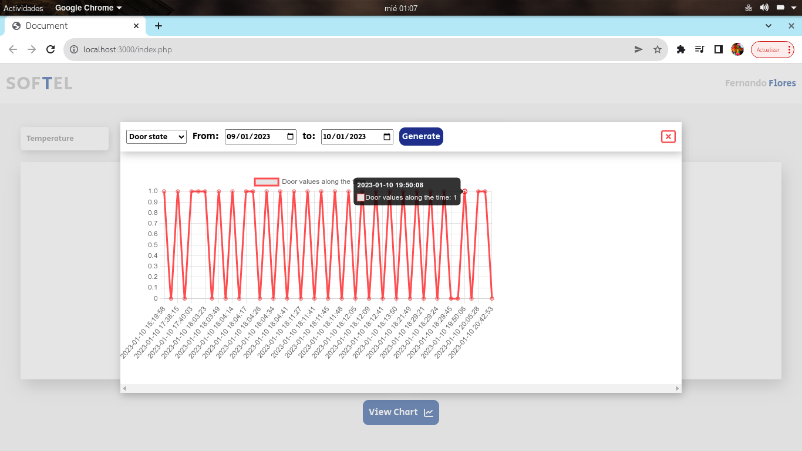
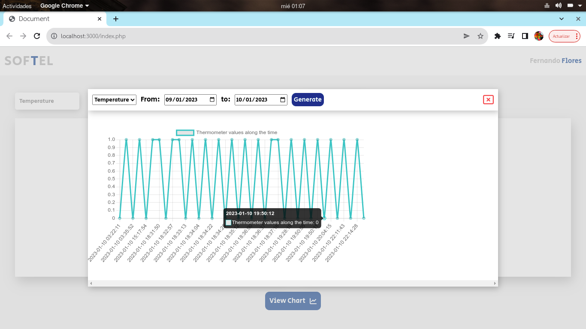

# Exercise using PHP to storage data on a MySQL database using ajax and displaying a line chart with the stored data

In the 'ejercicio.sql' we can find the code to generate the database used for this repo.
I used MySQL and we can conect the MySQL using the 3306 port.

Check if the project works for you if don't and you are working with ubuntu you should probably run the following commands (that might fix the database connection error):

- apt-get install php-mysql
- apt-get install php7.0-mysql

### Example of door data

| Door data                     |
| :---------------------------: |
| |

### Example of thermometer data

| Thermometer data                     |
| :----------------------------------: |
| |